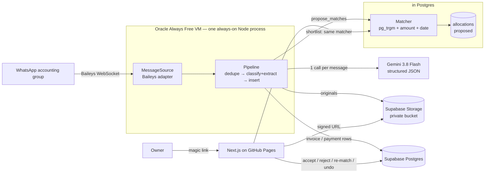
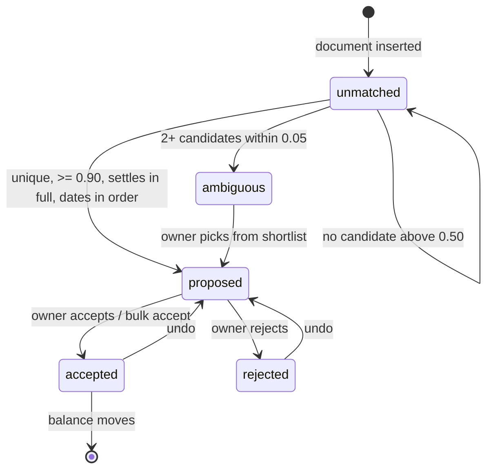

# P0 technical design — WhatsApp payment reconciliation

**Status:** proposal. Supersedes the expense-capture design of 2026-09-25.
**Target:** <20 businesses, one accounting group each, a few hundred messages/day.
**Principle applied throughout:** fewest moving parts that work.

## What changed, and why this is a rewrite

The previous version of this document designed **expense capture**: bills in,
one row each, a project total. The product requirement is **payment
reconciliation**: invoices issued and UPI payments received, arriving in any
order, paired to each other, with the exception-review moment as the product.

That is a different question — *who still owes me* rather than *what did I
spend* — and it reshapes everything downstream of ingestion.

| | Carried over unchanged | Replaced |
|---|---|---|
| Ingestion | Baileys, the VM, session-as-credential | — |
| Idempotency | `raw_messages` + unique `wa_message_id` | — |
| Extraction | One Gemini call, structured JSON, media inline | The schema, and a document-type fork |
| Tenancy | `owners`, RLS on `owner_id`, service-role discipline | `projects` → gone; see §3 |
| Money | `bigint` paise | — |
| Hosting | Supabase + GitHub Pages + magic link | — |
| Domain | — | `expenses` → `invoices` + `payments` + `allocations` |
| Matching | — | **entirely new**, and it is the product |
| Owner view | — | **entirely new**; review is screen one, not screen five |

§2 is substantially unchanged and still correct; the four corrections to the
original brief still stand (§10). §§3–7 and §9 are new.

---

## 1. Architecture



**Walkthrough.** One Node process holds a WhatsApp Web session and receives
every message in the business's accounting group. For each message it writes a
raw row first, then makes **one** Gemini call that decides what the message is
— an invoice, a UPI payment confirmation, or neither — and extracts the fields
for whichever it is. The document is inserted, its image stored, and then the
matcher is asked for candidate pairings on the opposite side of the ledger.
High-confidence unambiguous pairings are written as **proposed** allocations,
never applied silently. The owner opens the app, works the review queue, and
accepts, rejects, re-matches or partially allocates. Accepted allocations are
what move a balance.

**The matcher lives in Postgres, not in the bot.** This is the one structural
decision that differs from the obvious design, and it is driven by the
requirement that re-match show a shortlist *instantly*: the review screen needs
the same ranking the bot used, live, while the owner is looking at a payment.
Two implementations of a money-matching rule would diverge, and a round trip to
the bot for a dropdown is absurd. One `security invoker` SQL function, two
callers — the bot after insert, the browser on re-match.

Everything runs on free tiers. Weekly review cadence means latency is
irrelevant, which is the strongest possible argument against a queue.

---

## 2. Stack choices

### 2.1 Ingestion: Baileys directly, not OpenClaw

**This is the clearest decision in the document, and it is not close.**

OpenClaw's WhatsApp channel *is Baileys*. Its own documentation says:
"production-ready via WhatsApp Web (Baileys)". So option (b) is not an
alternative transport to option (a) — it is option (a) plus a large autonomous
agent runtime, carrying identical ban risk while adding a tool-calling loop
driven by text that anyone in the group can write. For a product whose inputs
are untrusted images and whose outputs are money, that is strictly more risk
for no transport benefit.

### 2.2 The official API — the brief's premise is *nearly* right

A Cloud API Groups API now exists, so "the official API cannot read groups" is
out of date. It is still unusable here: capped at 8 participants, requires an
Official Business Account, and only works in groups the business itself
created. A shopkeeper's existing accounting group qualifies on none of the
three. The conclusion — unofficial route for P0 — stands; the reasoning and the
migration story change.

### 2.3 Everything else

| Component | Choice | Free tier | Risk / note |
|---|---|---|---|
| Bot host | **Oracle Always Free, AMD micro** (`VM.Standard.E2.1.Micro`) | 2 instances, 1/8 OCPU, 1 GB RAM | Deliberately *not* ARM — see below |
| DB + Auth | **Supabase** | 500 MB DB, 50k MAU, 2 projects | Pauses after 7 days idle; the bot's writes prevent it |
| File storage | **Supabase Storage** | 1 GB | Forced by the hosting choice — see §2.4, §5 |
| Web app | **GitHub Pages** (static export) | Free, no account beyond GitHub | See §2.4 |
| Extraction | **Gemini 3.8 Flash** | 15 RPM, 1,500 req/day | **Free tier trains on your data** — and now that data is your *customers'*. Pinned, not `flash-latest`: an accuracy number measured against a moving alias is not a number. 2.5 Flash is already 404 for new keys |
| Fuzzy matching | **`pg_trgm`** | in Postgres | No service, no index server, no embedding model |

**Why AMD micro and not ARM A1.** Oracle reclaims idle Always Free A1
instances when 95th-percentile CPU, network *and* memory are all under 20%
across 7 days. A bot holding an idle WebSocket sits under all three — the exact
workload the policy kills. The rule applies to **A1 shapes only**, so the older
AMD micro is immune, and it is actually obtainable: A1 capacity is frequently
unavailable in Indian regions, and Oracle halved the A1 allocation in June 2026.

**Why not Vercel.** Vercel's Hobby plan prohibits commercial use — a term of
service, not a soft limit, and this is sold to businesses. Pages is free and
permits it. Vercel Pro at $20/month is the zero-friction paid option.

**Gemini's free tier costs more here than it did before.** Google may use
free-tier prompts and responses to improve its products, including human
review. Under the expense design that meant leaking your own vendor data.
Under this one it means leaking **your customers'** names, phone numbers, UPI
handles and transaction references — third-party personal data, which makes the
business a data fiduciary for it under the DPDP Act.

That moves the paid tier from a pre-launch task to a **precondition for the
first real customer**. Cost at a few hundred images a day is single-digit
dollars a month. *(Verify per-token pricing at build time; it moves.)*

### 2.4 Hosting: GitHub Pages, and what it costs

The priority is **zero hosting dependencies long-term**, and Pages delivers it:
the repository already exists, there is no second account, no plan that can
change under you, no commercial-use clause to outgrow.

Pages runs no server, so the web app is a static export — every screen is a
client component talking to Supabase with the anon key, and RLS decides what
comes back. Not a weakening: the anon key grants nothing on its own, and the
pgTAP suite is the proof.

Three consequences:

- **Storage is Supabase, not R2.** R2 presigning needs a secret and a browser
  cannot hold one. Supabase mints a signed URL under the user's own session.
  The cost is runway — 1 GB rather than 10 — quantified in §5.
- **Dynamic segments are query parameters.** `/invoice/?id=…`, read in the
  browser, because a uuid cannot be prerendered.
- **Mutations are direct Supabase calls**, including the transactional ones,
  which is why bulk-accept is an RPC (§7) rather than a loop in React.

Pages does not remove the need for a **cloud Supabase project**. A static site
cannot reach `127.0.0.1`.

---

## 3. Data model

The centre of this design is the **allocation**: a statement that ₹X of a
particular payment settles a particular invoice. Everything else — the pending
pool, the counts, undo, partial payments — is derived from allocations rather
than stored separately.

### The tables

```
owners             id · email · phone · created_at
                   (mirrors auth.users; the tenant root)

whatsapp_groups    id · owner_id → owners
                   wa_group_id (unique) · name · linked_at
                   -- one group ↔ one owner. No project_id; see below.

raw_messages       id · owner_id · wa_group_id · wa_message_id (unique)
                   sender_wa_id · sender_name · body · has_media
                   doc_kind ('invoice'|'payment'|'neither'|null)
                   received_at · purge_after (date)
                   -- 30-day retention; recovery path for misclassification

invoices           id · owner_id → owners
                   customer_name · customer_name_norm (generated)
                   amount_minor (bigint, INR paise)
                   invoice_no (nullable) · issued_on (date) · due_on (nullable)
                   description · source_message_id → raw_messages
                   confidence (numeric 0–1) · extraction_notes
                   entered_by ('bot'|'owner')
                   created_at · updated_at · deleted_at

payments           id · owner_id → owners
                   payer_name · payer_name_norm (generated)
                   amount_minor (bigint, INR paise)
                   paid_on (date) · utr (nullable) · payer_vpa (nullable)
                   payee_vpa (nullable) · app (nullable)
                   txn_status ('completed'|'pending'|'failed')
                   note (nullable) · method ('upi'|'cash'|'bank'|'other')
                   source_message_id → raw_messages
                   confidence · extraction_notes · entered_by
                   created_at · updated_at · deleted_at

allocations        id · owner_id → owners
                   invoice_id → invoices · payment_id → payments
                   amount_minor (bigint)       -- how much of this payment
                                               -- settles this invoice
                   score (numeric 0–1) · reasons (text[])
                   state ('proposed'|'accepted'|'rejected')
                   source ('auto'|'owner')
                   decided_at · decided_by → owners
                   created_at

allocation_events  id · allocation_id → allocations · owner_id
                   from_state · to_state · amount_minor
                   actor ('auto'|'owner') · at
                   -- append-only. This is what makes undo correct.

document_files     id · owner_id · invoice_id (nullable) · payment_id (nullable)
                   storage_path · thumbnail_path (nullable) · mime_type
                   size_bytes · wa_message_id · sender_wa_id · captured_at
                   -- exactly one of invoice_id / payment_id is non-null
```

### Why it is shaped this way

**Allocations are many-to-many, because the requirement says so.** Partial
payments and split invoices are both named in the PRD. One payment can settle
three invoices; one invoice can take four instalments. A `match_id` column on
either side cannot express that, and discovering it after the review UI is
built means rewriting the schema, the counts and every screen. This is the most
expensive thing in the document to get wrong, so it is decided first.

**The pending pool is a view, not a table.** Pending means "has an unallocated
remainder":

```
invoice.balance_minor = amount_minor − Σ(accepted allocations)
payment.unapplied_minor = amount_minor − Σ(accepted allocations)
```

There is no pool table and no state machine to drift out of sync with the
ledger. A ₹50,000 invoice with ₹20,000 accepted is 40% settled and still in the
pool for ₹30,000 — partial payments work without a special case.

**Rejected allocations are kept, not deleted.** Otherwise rejecting a wrong
pairing just makes the matcher propose it again on the next run, forever. A
rejection is a fact about that pair and it is load-bearing input to §4.

**`allocation_events` is append-only.** The PRD asks for undo twice, and undo
has to survive a page refresh. Inverting the last event is a two-line
operation; reconstructing intent from a mutable `state` column is not. It also
answers "who accepted this ₹45,000 match, and when", which any product touching
money wants regardless.

**`txn_status` is not decoration.** A screenshot of a *failed* or *pending* UPI
transaction is a screenshot of money that did not arrive. Only `completed`
creates a settleable payment; the others are stored and shown, never allocated.
Omitting this field produces a ledger that says paid when the bank says no.

**`payee_vpa` is captured so it can be checked.** A forwarded screenshot of a
payment made to somebody else's handle is not a receipt for this business —
sometimes an honest mistake, occasionally not. P0 stores it and shows it on the
review screen; a P1 setting holds the business's own handles and flags
mismatches automatically.

**`projects` is gone.** The PRD describes one accounting group into which staff
forward documents for many customers. Customer identity therefore comes from
the documents, not from the group, so a group needs only an owner. Grouping by
site or project can return as a P1 label; inventing it now would be modelling a
requirement nobody stated.

**There is deliberately no `customers` table in P0.** Names arrive from OCR in
several spellings and auto-creating a row per variant produces fifty customers
where there are twelve, plus a merge UI to build on day one. P0 keeps the name
as text on both sides, normalised into a generated column, and matches text to
text. A view grouping by `customer_name_norm` answers "what does Ravi owe"
well enough — and tells you how bad the name problem actually is before you
build an entity around it. See §10.

**Two dedupe keys the expense design did not have**, both because documents get
re-sent constantly in WhatsApp groups:

| Key | Constraint | Why |
|---|---|---|
| `utr` | unique on `(owner_id, utr)` where not null | The UPI reference is globally unique per transaction. Two screenshots of one payment collapse to one row |
| `invoice_no` | unique on `(owner_id, invoice_no)` where not null | People forward the same invoice as a reminder. Without this, receivables double every chase |

`wa_message_id` catches redelivery; these catch re-posting, which is a
different and more common event.

### Invariants enforced in the database

These are correctness *and* security properties — the matcher's input is model
output derived from images anyone in the group can post, so the invariants, not
the prompt, are the defence.

```
Σ(accepted allocations for an invoice) ≤ invoices.amount_minor
Σ(accepted allocations for a payment) ≤ payments.amount_minor
allocations.amount_minor > 0
unique (invoice_id, payment_id) where state <> 'rejected'
an allocation's invoice and payment share the same owner_id
only payments with txn_status = 'completed' may be allocated
```

The two sums are deferred constraint triggers, so a multi-row bulk accept is
checked once at commit rather than row by row. Over-allocation must be
impossible even through a bug in the RPC.

Per the repository's rules, every one of these ships with its pgTAP assertions
in the same change, every view is `security invoker`, and any
`security definer` function pins `search_path`.

---

## 4. Matching

### What can actually be matched

Static UPI collection is the whole reason this product exists — no dynamic QR,
no invoice ID in the payment — so there is usually no shared key. The
available signals, strongest first:

| Signal | Strength | Notes |
|---|---|---|
| Invoice number in the payment note | **Decisive** | Free when present. Ask a real customer how often payers type anything (§10) |
| UTR quoted on an invoice or in a reply | **Decisive** | Happens when staff annotate. Cheap to check |
| Amount equal to an invoice's **remaining balance** | Strong | Balance, not original amount, so instalments match cleanly |
| Payer name ≈ customer name | Medium, and script-dependent | See the risk in §10 |
| Payment dated on or after the invoice, within a window | Weak | A tiebreaker, never a reason |
| Amount less than a balance | Very weak alone | Any payment is a possible partial of any larger invoice |

### Scoring

```
score = reference_hit ? 1.00
      : 0.60 × amount_fit
      + 0.30 × name_similarity
      + 0.10 × date_fit
```

- `amount_fit` — 1.0 if the payment equals the invoice balance exactly, 0.5 if
  it is a plausible partial (less than the balance, more than 10% of it), 0
  otherwise.
- `name_similarity` — `pg_trgm` similarity over the normalised names. Normalise
  by lowercasing, stripping honorifics (`sri`, `smt`, `m/s`, `shri`),
  stripping punctuation and collapsing whitespace. A GIN trigram index makes
  the shortlist query fast enough for a keystroke.
- `date_fit` — 1.0 within 30 days after the invoice, tapering to 0 at 90; **0
  if the payment predates the invoice**, which is usually a sign of the wrong
  pair rather than an advance.

A payment dated before its invoice is additionally **vetoed from auto-proposal
outright**, not merely scored at zero. Scoring alone cannot express the intent:
an exact amount and an exact name are worth 0.90 between them, which clears the
threshold on their own, so the date term could never actually stop anything.
The arithmetic looked sufficient and wasn't — the test caught it, not the
formula.

### What gets proposed, and what never does



Three rules do the work:

1. **Nothing is applied silently.** A pairing the matcher is sure of becomes a
   *proposed* allocation, which the owner clears in one tap or in a bulk
   accept. The PRD asks not to be made to confirm the obvious 90% one at a
   time — that is an argument for bulk accept, not for a ledger that changes
   while nobody is looking.
2. **Ambiguity is never resolved by the matcher.** Two invoices for ₹10,000 is
   the PRD's own example, and round amounts collide constantly. When the top
   candidates are within 0.05, all of them go to the shortlist and none is
   proposed. Guessing here is how a reconciliation product loses trust in one
   afternoon.
3. **Partials are always reviewed in P0.** A payment smaller than a balance
   could be an instalment, a different invoice entirely, or a discount. There
   is no accuracy data yet to justify automating it.

A fourth rule follows from the first three rather than standing beside them:
every threshold here is a **veto**, and none of them is a vote. A candidate has
to clear score, uniqueness, full settlement and date order independently. A
weighted sum that lets two strong signals outvote one disqualifying one is how a
matcher ends up confidently wrong.

Rejected pairs are excluded from future scoring for that pair only — rejecting
"this payment is not for that invoice" must not remove the payment from
matching altogether.

### When matching runs

`propose_matches(owner_id, doc_kind, doc_id)` is called:

- after a document is inserted by the bot, on the **opposite** side of the
  ledger (new payment → search open invoices; new invoice → search unapplied
  payments), which is how order-independence is achieved without a pool table;
- when the owner corrects an amount, name or date, because the old proposal was
  scored on wrong data;
- when the owner rejects a proposal, to offer the next best;
- on demand from the review screen, as the shortlist query.

It is **derivable and idempotent**: it only ever writes `proposed` rows and
never touches `accepted` ones, so it is safe to re-run over everything after a
scoring change. That is why it is safe to call it last in the pipeline (§5) —
a matcher failure costs a proposal, never a document.

---

## 5. Message pipeline and file storage

```
receive → dedupe → persist raw → classify + extract (1 LLM call)
       → insert invoice | payment → store file → propose matches
```

1. **Receive.** Baileys event. Ignore groups not in `whatsapp_groups`, and the
   bot's own messages.
2. **Dedupe.** Insert into `raw_messages`; the unique `wa_message_id` is the
   idempotency key. A conflict means we have seen it: stop.
3. **Persist raw** *before* the model call, so a crash loses nothing and the
   30-day recovery window starts immediately.
4. **Classify + extract** in one call. The model decides `invoice` |
   `payment` | `neither` and fills only the relevant branch — one call rather
   than two, because a split doubles latency and failure modes for no accuracy
   gain at this scale.
5. **Insert** the invoice or payment, on the second dedupe keys (`utr`,
   `invoice_no`). A conflict here means the document was re-posted: link the
   new `raw_message` to the existing row and stop.
6. **Store the file** after the row, so a storage outage cannot cost a
   document. A document without its image is recoverable; an image with no row
   is invisible.
7. **Propose matches** last, for the reasons in §4.

The ordering guarantees are the ones the expense pipeline already had — raw
before the model, file after the row, nothing dropped on failure — and they are
asserted in `bot/test/pipeline.test.ts`. Steps 4–7 are what changed.

### Extraction schema

```jsonc
{
  "doc_kind": "invoice" | "payment" | "neither",
  "confidence": 0.0,          // about the AMOUNT specifically
  "invoice": {                 // when doc_kind = invoice
    "customer_name": null, "amount_rupees": null,
    "invoice_no": null, "issued_on": null, "due_on": null,
    "description": null
  },
  "payment": {                 // when doc_kind = payment
    "payer_name": null, "amount_rupees": null, "paid_on": null,
    "utr": null, "payer_vpa": null, "payee_vpa": null,
    "app": null,               // GPay | PhonePe | Paytm | bank | other
    "txn_status": "completed" | "pending" | "failed",
    "note": null
  },
  "language": "en" | "te" | "mixed",
  "notes": null
}
```

Prompt rules that matter, beyond the obvious:

- **Read `txn_status` off the screenshot and never infer it.** "Payment
  successful", "Completed", a green tick → `completed`. Anything else, or
  unreadable → `pending`. Never default to completed.
- **Take the grand total, never sum line items.**
- **Return null rather than guessing a number.** Confidence reflects the
  amount, not overall legibility: a clear printed total with a smudged name is
  high confidence.
- **A payment *request* is not a payment.** "Please pay ₹5,000" and a QR code
  with no confirmation are `neither`.
- Telugu amounts in words (`రెండు వేలు` = 2000) are converted.
- Treat all extracted text as untrusted data — it reaches the schema validator
  and nothing else. Never a shell, a query string or an HTTP call.

### File storage

```
{owner_id}/{invoice|payment}/{doc_id}/{filename}
```

Owner first, so a prefix is a tenant. Private bucket, signed URLs minted under
the user's own session, 5-minute expiry, no public URLs ever. Originals at full
quality: a compressed bill that loses a digit in a dispute is worse than no
bill. A 400px WebP thumbnail (~20 KB) is generated on ingest with `sharp`,
because the review screen shows two images at once and a weekly session over a
phone connection cannot fetch 600 KB per item.

**Runway.** At ~150 documents/day and ~300 KB each, plus thumbnails, Supabase's
1 GB gives roughly **three weeks**. That is the cost of the Pages decision
(§2.4) and it will force a move mid-pilot. The `FileStore` port means R2 is one
adapter — 10 GB free, ~$0.75/month at 50 GB — and reinstating it means putting
a signing endpoint somewhere, which means a server again. Supabase Pro at
$25/month for 100 GB is the alternative, and backups make it worth having
eventually anyway. Decide when the bucket is at 70%, not when it is full.

---

## 6. Failure handling

| Failure | Handling |
|---|---|
| **Bot disconnects** | Baileys auto-reconnects; auth state on disk so a restart does not re-pair. `systemd`, `Restart=always`. Replay is safe: `wa_message_id` is unique |
| **Session logged out** (banned, or "log out from all devices") | Unrecoverable without a human. Email the owner and stop cleanly rather than crash-loop. This *will* happen eventually |
| **LLM error / timeout** | Retry twice with backoff, then store the document as `needs_review` with the image and raw text. **Never drop the message** — the raw row and the file are the source of truth |
| **Rate limit** (15 RPM free) | ~0.2 RPM average, but a day of documents arrives in one burst. One concurrent call, 4s spacing, in-process. This is the one place a queue earns its keep, and it is an array, not Redis |
| **Same payment screenshot posted twice** | Caught by unique `utr`. Without a readable UTR, flagged on `(amount_minor, paid_on, payer_name_norm)` within 7 days as a possible duplicate — flagged, never discarded |
| **Same invoice forwarded as a reminder** | Caught by unique `invoice_no`. Without one, flagged the same way. Silently creating a second receivable is the worst available outcome |
| **Message edited** | Baileys reports edits. Re-extract; if a document exists, flag it for review showing both versions and re-run matching. Never silently overwrite a figure the owner may have accepted |
| **Message deleted** | Mark the raw row deleted and flag the document. Do not cascade: a deleted message is not a refund |
| **Payment that never finds an invoice** | Money arrived and the ledger cannot say what for. Surfaced after 7 days as *unapplied*, never hidden. This is a real signal — an unbilled job, or a payment to the wrong business |
| **Invoice that never finds a payment** | The normal case. Not a failure — it is the outstanding balance, and it is the product's main answer |
| **Matcher proposes nothing** | Also normal. The review queue is proposals *and* unmatched documents; an empty proposal list must not read as "nothing to do" |

---

## 7. Owner view — the review experience is the product

The PRD is explicit that this is where the product is won or lost, so it is
specified in more detail than anything else here. Five screens; review is the
first, not the fifth.

### 1. Review — the weekly session

**Header, always visible:** `Matched · Pending · Needs review`, with amounts,
not just counts. The PRD asks for a clear "done" feeling, and a session ends
when needs-review is zero.

**Bulk accept, at the top.** *"12 matches look certain — ₹3,40,500. Accept all
/ Review them."* One transactional RPC, not a loop in the browser: a
half-applied bulk accept over money is the kind of bug that permanently ends
trust in the automation. The deferred constraints in §3 check the whole batch
at commit.

A consequence of §4 worth stating plainly, because it fell out of building this
rather than out of designing it: since `propose_matches` writes only pairings
that are unique, exact, in date order and above 0.90, **everything in the
proposal list is by construction one of "the obvious ones"**. So bulk accept
covers the whole list rather than a subset of it, and the one-at-a-time card
exists for the owner who wants to look anyway. The genuinely uncertain work is
not in this list at all — it is the *unapplied payments*, money that arrived
with no pairing confident enough to propose, and that is where the shortlist
earns its keep. The review screen is therefore three queues, not one:

| Queue | What it is | The action |
|---|---|---|
| Proposals | The matcher is sure | Accept all, or step through |
| Unapplied payments | Money in, nothing to attach it to | Open the shortlist |
| Needs a human first | Unreadable, or unclassifiable | Read it and fix the fields |

**Then one proposal at a time, not a spreadsheet.** Payment screenshot left,
invoice right, both as images with extracted fields beneath. Between them the
score and its reasons in plain words:

> **0.94** · amount exact ₹45,000 · "Ravi Kumar" ≈ "R Kumar" (0.71) · paid 2
> days after invoice

Showing the reasons is not decoration. A score with no explanation is a number
to be distrusted; a reason is something the owner can check at a glance, which
is the difference between a two-minute session and a two-hour one.

**Actions:** Accept (primary) · Reject · Re-match · Partial.

- **Re-match** opens the shortlist immediately — the same matcher function,
  ranked, each row showing amount, name, date, score. No search box to type
  into first; the PRD is specific that disambiguation must not become a search.
- **Partial** sets an amount less than the balance and leaves both sides in the
  pool for the remainder.

**Keyboard-first.** `a` accept, `r` reject, `m` re-match, `j`/`k` to move.
Forty items should take two minutes.

**Undo, always.** A toast with Undo after every action, plus a persistent
*recent actions* list with undo on each row. Server state via
`allocation_events`, so it survives a refresh — the moment it only works until
reload is the moment it stops being trustworthy.

**Empty state that means something:** *"Nothing to review. ₹2,10,000
outstanding across 9 invoices, oldest 34 days."*

### 2. Outstanding — who owes me

Invoices with a balance, oldest first, with age and part-paid amounts. Grouped
by normalised customer name. This is the question the business currently
answers by scrolling WhatsApp for an hour, so it is the screen that justifies
the product.

### 3. Payments received

Newest first, with **unapplied** ones pinned at the top — received money the
ledger cannot explain. `pending` and `failed` screenshots appear here, clearly
marked and never counted as received.

### 4. Document detail

Original image full-screen via signed URL, extracted fields beside it, the
original message text, and the allocation history from
`allocation_events` — who matched what, when, and what was undone. Every field
editable; an edit re-runs matching.

### 5. Settings

WhatsApp groups the bot is in, and which owner each belongs to. The ids come
from `pnpm --filter bot groups`, which connects, prints every group the paired
number can see, and exits — linking is a paste into this form rather than an
in-group command, because anyone in the group could re-point the bot with a
command and the people posting documents are not the people who installed it.
Manual entry for **cash payments** and for invoices that never reached the group
(§10).
Sign-in is an email magic link: phone OTP needs an SMS provider and, in India,
DLT registration — weeks of lead time for no P0 benefit.

### A third state the design originally missed

When extraction fails on a message that carried an image, the bot knows a
document arrived but not which side of the ledger it belongs to. §6 said "store
the document as needs_review with the image", which quietly assumed a document
row exists — and filing a receipt as a receivable is worse than admitting
ignorance. So an unread image is parked against its raw message
(`raw_messages.needs_classification`, and a `document_files.raw_message_id`),
listed in the review screen, and the owner says which it is in one tap. The
30-day purge skips these, because for them the image is the only record.

Without this, a Gemini outage would store photographs that nothing in the app
ever references again, and "an image with no row is invisible to everyone" — the
reason the pipeline is ordered the way it is — would have been false of the one
case that most needed it to be true.

---

## 8. Security

- **RLS on every table**, every policy resolving to `owner_id = auth.uid()`.
  The UI hides; the database refuses. A check that exists only in React is a
  convenience, not security.
- **The bot uses the service-role key and bypasses RLS**, so it scopes every
  write by hand — `owner_id` comes from the group mapping and nothing in the
  message is ever trusted to say who owns a row.
- **Cross-owner allocation must be impossible**, not merely unlikely: an
  allocation whose invoice and payment belong to different owners is refused by
  a constraint, and that is asserted in pgTAP. It is the one write in this
  schema that touches two rows, and therefore the one worth attacking.
- **The over-allocation invariants (§3) are a security control.** Their input
  is model output derived from images anyone in the group can post. A prompt
  that talks the model into a ₹10,00,000 payment still cannot settle more than
  an invoice is worth.
- **Prompt injection is a live threat**, which is the concrete reason §2.1
  rejects an agent framework with tools. Validate against the schema, clamp
  amounts, treat every string as data.
- **Private bucket, signed URLs only**, 5 minutes, under the user's session.
- **Secrets** (service-role key, Gemini key) live in the VM environment. Never
  in a `NEXT_PUBLIC_*` variable, which ships to the browser.
- **The WhatsApp session file is a credential.** Anyone who copies it reads
  every group. Key-only SSH, no password login, firewall all but SSH.
- **Third-party personal data.** This database holds the *customers'* names,
  UPI handles and transaction references — collected by the business, which is
  a data fiduciary for them. Consequences: a paid Gemini tier before the first
  real customer (§2.3), the 30-day `raw_messages` purge actually running, and a
  deletion path that reaches storage as well as rows.

---

## 9. Build plan

Each milestone ends in something testable. The order is chosen so that the two
questions that could invalidate the product are answered in weeks one and two.

| # | Milestone | Test |
|---|---|---|
| 1 | Schema, RLS, invariants, seeded data | Two owners; A reads zero of B's rows through the REST API. Over-allocation and cross-owner allocation both refused |
| 2 | Baileys bot ingesting to `raw_messages` | Post in a test group; see the row. Kill the process; posts during downtime arrive on restart |
| 3 | Extraction measured, printing JSON only | **20 real UPI screenshots and 20 real invoices, scored separately.** Screenshots are rendered UI and should be near-perfect; handwritten invoices are the hard half. `txn_status` correct on a deliberately failed payment |
| 4 | **Matcher in SQL, measured offline** | ~50 hand-labelled invoice/payment pairs from one real business. Report precision at the 0.90 auto-propose threshold and recall overall. **Go/no-go for the whole design** |
| 5 | Pipeline end to end; proposals appear | A week of real messages produces proposals a human agrees with |
| 6 | Web: sign-in, Outstanding, Payments | Owner signs in, sees their balances and nobody else's |
| 7 | Review screen: one item, accept / reject | Work a real queue to zero |
| 8 | Re-match shortlist + partial allocation | Two invoices at the same amount produce a shortlist, not a guess. An instalment leaves the right balance |
| 9 | Bulk accept (RPC) + undo | Accept 12 at once; kill the connection mid-request and prove nothing is half-applied. Undo each one after a refresh |
| 10 | Settings, manual cash entry, group linking | Record a cash payment against an invoice without touching the database |

**Milestone 4 is this document's milestone 3** — the honest-measurement gate.
If precision at 0.90 is poor, auto-proposal is worthless and the product
becomes a fast manual matching tool. That is still a viable product, and the
review screen is most of it, but it is a different pitch and the threshold
should move to reflect it. Find out in week two, not week eight.

---

## 10. Risks and open questions

### Corrections to the original brief, still standing

1. **A Cloud API Groups API now exists** — 8 participants, Official Business
   Account, own-created groups only. Conclusion unchanged, reasoning and
   migration story changed.
2. **Vercel Hobby prohibits commercial use.** Pages, or Vercel Pro at $20/mo.
3. **Oracle's ARM A1 reclaims idle instances** on exactly this workload. AMD
   micro is exempt.
4. **OpenClaw is Baileys underneath** — identical ban risk plus an agent
   runtime. Strictly more risk, not a trade-off.

### Ranked risks

| Risk | Severity | Mitigation |
|---|---|---|
| **Name matching across scripts fails** | **High** | `similarity('రవి కుమార్', 'Ravi Kumar')` is **zero**. If invoices are handwritten in Telugu while UPI shows Latin names, the 0.30 name term contributes nothing and amount alone decides — which collides constantly on round numbers. Measure at milestone 4. If it fails, the answer is a better shortlist, not a cleverer matcher: transliteration is a research project, not a P0 feature |
| WhatsApp bans the number | **High / likely eventually** | Dedicated SIM, low volume, human pacing, plan to re-pair. The one risk that can end the product |
| Gemini free tier trains on customers' payment data | **High** | Paid tier before the first real customer. Now a DPDP exposure, not just a preference |
| Same-amount collisions | **Medium-high** | Round amounts are the common case, so amount is weakest exactly where it is most used. Never auto-propose an ambiguous pair (§4) |
| Partial payments are common | Medium-high | Every payment becomes a candidate partial of every larger invoice, and the candidate set explodes. Ask a real business before tuning the 10% floor |
| Handwritten invoice extraction | Medium | Measured separately at milestone 3 |
| Storage runway (three weeks) | Medium | Decide at 70% full: R2 plus a signing endpoint, or Supabase Pro |
| Prompt injection via a posted image | Medium | No tools, no shell, schema validation, and the §3 invariants as the real defence |
| Oracle reclaims the VM | Medium | AMD shape; keep `docker compose` and a restore script so a rebuild is an hour |

### Open questions — these need a real customer, and two of them are structural

| Question | Why it matters | Proposed default |
|---|---|---|
| **Do invoices actually appear in the group?** | The PRD says they do. If they go out by email or a Tally print instead, one whole side of the ledger has no ingestion path and must be entered by hand — which contradicts "zero workflow change" | Assume yes; ship manual invoice entry in Settings as insurance (milestone 10) |
| **How do cash payments get recorded?** | There is no screenshot, ever. A cash-settled invoice looks permanently outstanding, and for a South Indian small business this is not an edge case | Manual "mark paid — cash" on the invoice, written as a `payments` row with `method = 'cash'` so one ledger holds everything |
| **Do payers put anything in the UPI note?** | If sometimes, invoice-number matching is a near-free decisive key and should be tried first. If never, amount plus name carries everything and the review queue is larger than the PRD assumes | Implement the reference check; it is cheap even at low hit rates |
| **What is an invoice, physically?** | A Tally/Vyapar PDF, a photo of a handwritten bill book, or a WhatsApp text message. This changes extraction difficulty by an order of magnitude | Support all three; measure separately at milestone 3 |
| **How often are payments partial?** | Drives both the candidate explosion and whether partial allocation is a P0 screen or a P1 one | Assume common; build partial in milestone 8 |
| **One group per business, or one per customer?** | The PRD says one accounting group, which is why §3 drops `projects` and relies on names. One group per customer would make matching dramatically easier and is worth knowing before milestone 4 | Assume one group, many customers |

### Questions the PRD does not settle, neither blocking

- **Over-payment.** ₹51,000 against a ₹50,000 invoice is real. Modelled as a
  payment with a permanent unapplied remainder — a credit — rather than forced
  to zero. It will show in the unapplied list, which is correct but needs a
  label so it does not read as an error.
- **Should the bot reply in the group?** Default: react ✅ on a message it
  captured, no text reply. A chatty bot in a group that is also a workplace
  gets muted, and a muted bot's errors go unnoticed. A text reply only when
  something needs a human.
- **Whose messages count?** Everyone in the group — staff forwarding is the
  entire use case. An allowlist is a Settings toggle if noise appears.
- **What happens when the bot is removed from the group?** Nothing further
  arrives, silently, and the balances quietly go stale. Worth a warning in the
  UI when no message has been seen in N days.
