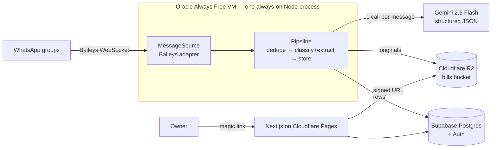

# P0 technical design — WhatsApp expense capture

**Status:** proposal, no code written.
**Target:** <20 owners, <50 groups, a few hundred messages/day.
**Principle applied throughout:** fewest moving parts that work.

Four things in the brief turned out to be wrong or out of date when checked
against current terms. They are flagged inline and summarised in §10.

---

## 1. Architecture



**Walkthrough.** One Node process on a free Oracle VM holds a WhatsApp Web
session through Baileys and receives every message in every group the bot has
been added to. For each message it first writes a raw row (cheap insurance
against a bad classification), then makes **one** Gemini call that both decides
whether the message is an expense and, if it is, extracts the fields — one call
rather than two, because a classify-then-extract split doubles the latency and
the failure modes for no accuracy gain at this scale. If it is an expense, any
image or PDF goes to R2 at full quality, an `expenses` row is written against
the group's project, and anything the model was unsure about lands in the
review queue rather than the ledger. The owner signs in to a Next.js app with a
magic link and sees only their own rows, enforced by Postgres row-level
security rather than by the UI.

Everything above runs on free tiers. The single process is deliberate: at a few
hundred messages a day, a queue would be more machinery to operate than the
problem justifies.

---

## 2. Stack choices

### 2.1 Ingestion: Baileys directly, not OpenClaw

**This is the clearest decision in the document, and it is not close.**

OpenClaw's WhatsApp channel *is Baileys*. Its own documentation says:
"production-ready via WhatsApp Web (Baileys)". So option (b) is not an
alternative transport to option (a) — it is option (a) plus a large autonomous
agent framework on top.

| | Baileys direct | OpenClaw |
|---|---|---|
| Transport | Baileys | **Baileys** (same) |
| Ban risk | Same | **Same** |
| Execution model | Deterministic function you wrote | Agent loop that decides what to do |
| Attack surface | One library | Agent runtime with shell, filesystem and web-browsing tools |
| Dependencies | ~1 | A whole platform |
| Group support | Yes | Yes, with sender allowlists |

The deciding factor is the brief's own requirement that the pipeline be
deterministic. OpenClaw's docs are explicit that it "is fundamentally an
autonomous agent framework, not a deterministic pipeline," and that structured
entry points "still funnel into the underlying agent runtime."

For financial data that is disqualifying on its own. An agent that can run
shell commands and browse the web, reading a stream of untrusted text and
images from a group anyone can post to, is a prompt-injection target with a
shell attached. A photo with "ignore previous instructions" written on the
bill is a plausible attack, not a hypothetical. Baileys gives the same
capability with none of that surface.

**Use OpenClaw if** you later want a conversational assistant in the group
("what did we spend on cement last month?"). That is a different product and
belongs behind its own credentials.

### 2.2 The official API — the brief's premise is *nearly* right

The brief says the Cloud API "doesn't practically support bots in regular
groups". A Groups API now exists on the Cloud API, so the literal claim is out
of date — but the conclusion still holds, for three reasons:

- The business must be an **Official Business Account**.
- Groups are capped at **8 participants**.
- There is **no endpoint to add a participant**, and only one Cloud API
  business may operate in a group.

Critically, the bot can only work in groups the *business number creates*. It
cannot join the existing group a contractor already runs with their site
supervisors — which is the entire product. So: unofficial route for P0, and
keep the `MessageSource` interface the brief asks for.

Be clear-eyed about what that interface buys. Swapping to the official API is
not a drop-in: it means asking every customer to abandon their existing group
and move ≤8 people into a business-created one. The interface makes the *code*
swappable; it cannot make the *migration* painless.

**Ban risk, stated plainly.** Baileys is an unofficial reimplementation of
WhatsApp Web and using it violates WhatsApp's terms. The number can be banned
with no warning or appeal. Mitigations: use a **dedicated SIM** that is not
anyone's personal number, keep volume low and human-paced, never send bulk or
unsolicited messages, and accept that re-pairing after a ban means a new
number and re-adding the bot to every group. Treat the number as disposable
and the session as something you will re-establish, not as infrastructure.

### 2.3 Everything else

| Component | Choice | Free tier | Risk / note |
|---|---|---|---|
| Bot host | **Oracle Always Free, AMD micro** (`VM.Standard.E2.1.Micro`) | 2 instances, 1/8 OCPU, 1 GB RAM each, always on | See below — deliberately *not* ARM |
| DB + Auth | **Supabase** | 500 MB DB, 50k MAU, 2 projects | Pauses after 7 days idle — the bot's own writes prevent this |
| File storage | **Cloudflare R2** | **10 GB**, no egress fees | 10× Supabase Storage; see §5 for why that decides it |
| Web app | **Cloudflare Pages** | Commercial use allowed | **Not Vercel** — see below |
| Extraction | **Gemini 2.5 Flash** | 15 RPM, 1,500 req/day | **Free tier trains on your data** — see below |

**Why AMD micro and not the ARM A1 the brief suggests.** Oracle reclaims idle
Always Free A1 instances when 95th-percentile CPU, network *and* memory are all
under 20% across 7 days. A bot holding an idle WebSocket and handling a few
hundred messages a day sits under all three — the exact workload the policy
kills. The reclamation rule applies to **A1 shapes only**, so the older AMD
micro is immune. It is also actually obtainable: A1 capacity is frequently
unavailable in Indian regions, and Oracle halved the A1 allocation to 2 OCPU /
12 GB in June 2026. 1 GB of RAM is enough for one Node process holding a
WhatsApp session.

**Why not Vercel.** Vercel's Hobby plan prohibits commercial use — it is a
term of service, not a soft limit, and this is a product sold to businesses.
Cloudflare Pages' free tier permits commercial use. If you would rather not
adapt Next.js for Cloudflare, **Vercel Pro is $20/month** and is the
zero-friction paid option.

**Gemini's free tier is not free of consequences.** Google may use free-tier
prompts and responses to improve its products, including human review. You
would be feeding photographs of customers' bills — vendor names, amounts,
phone numbers, sometimes GSTINs — into that. That is fine for a pilot with
synthetic or consented data and **not** fine for real customers.

Recommendation: build and pilot on the free tier with your own test bills,
then switch to the paid tier before onboarding a real customer. At a few
hundred images a day the paid cost is single-digit dollars a month — the
cheapest line item in this document. *(Verify current per-token pricing at
build time; it moves.)*

On handwritten Indian bills specifically: Gemini Flash handles images and PDFs
natively and is the right starting point. Do not add a separate OCR stage.
Measure accuracy on ~50 real bills before considering anything more elaborate
— the review queue exists precisely so that imperfect extraction is safe.

---

## 3. Data model

Seven tables. Roles are absent by design but the shape allows them later: every
row hangs off `owner_id`, so a future `project_members` table adds access
without reshaping anything.

```
owners          id · email · phone · created_at
                (mirrors auth.users; the tenant root)

projects        id · owner_id → owners · name · created_at · archived_at

whatsapp_groups id · owner_id → owners · project_id → projects
                wa_group_id (unique) · name · linked_at
                -- one group ↔ exactly one project

categories      id · owner_id → owners · name · is_default
                -- seeded per owner on signup

expenses        id · owner_id → owners · project_id → projects
                amount_minor (bigint, INR paise) · spent_on (date)
                vendor · description · category_id → categories
                posted_by_wa_id · posted_by_name
                source_message_id → raw_messages
                status ('confirmed' | 'needs_review')
                confidence (numeric 0–1) · extraction_notes
                created_at · updated_at · deleted_at

expense_files   id · expense_id → expenses · storage_path · mime_type
                size_bytes · wa_message_id · sender_wa_id
                captured_at · thumbnail_path (nullable)

raw_messages    id · wa_group_id · wa_message_id (unique) · sender_wa_id
                body · has_media · received_at · purge_after (date)
                -- 30-day retention; the recovery path for misclassification
```

Three deliberate choices:

- **Money is `bigint` paise, never a float.** A rupee amount in a float is a
  rounding error waiting to become a dispute.
- **`wa_message_id` is unique on `raw_messages`.** This is the idempotency key
  that makes the whole pipeline safe to retry (§6).
- **Soft delete on `expenses`.** An owner deleting an expense should not
  destroy the link to the original bill.

---

## 4. Message pipeline

```
receive → dedupe → persist raw → classify+extract (1 LLM call)
       → store file → save expense → confidence gate
```

1. **Receive.** Baileys event. Ignore anything from a group not in
   `whatsapp_groups`, and ignore the bot's own messages.
2. **Dedupe.** Insert into `raw_messages` with `wa_message_id` unique. A
   conflict means we have seen it: stop.
3. **Persist raw** *before* calling the model, so a crash mid-pipeline loses
   nothing and the 30-day recovery window starts immediately.
4. **Classify + extract** in one call (schema below). Media is sent inline.
5. **Store file.** Only if `is_expense`. Original at full quality to R2.
6. **Save expense** against the group's project.
7. **Confidence gate.** `confidence < 0.75`, or any required field null, →
   `status = 'needs_review'`. Otherwise `'confirmed'`.

### Prompt

```
You extract expense records from messages in a WhatsApp group used by a
small business in South India. Messages may be English, Telugu, or both
mixed in one message. Bills may be handwritten, blurry, or photographed at
an angle.

Decide first whether this message records money the business SPENT.

NOT expenses: greetings, planning, questions, "I will pay tomorrow",
photos of work or materials with no amount, forwarded promotions,
payment requests that have not been paid yet.

ARE expenses: a bill or invoice image, a payment screenshot, or text
stating an amount that was paid.

If it is an expense, extract:
- amount: the TOTAL paid, in rupees. If the bill shows a grand total and
  line items, take the grand total. Never sum the items yourself.
- date: when the money was spent (the bill date, not today) as YYYY-MM-DD.
  If absent, use the message date supplied below.
- vendor: who was paid. Shop name if visible, else the person's name.
- description: a short phrase in English, under 60 characters.
- category: exactly one of the provided list, else "Other".

Rules:
- Return null for anything you cannot read. Never guess a number.
- Confidence must reflect the amount specifically. A clear printed total
  is high; a smudged handwritten figure is low even if everything else is
  legible.
- Telugu amounts in words ("రెండు వేలు" = 2000) should be converted.

Message date: {message_date}
Sender: {sender_name}
Available categories: {category_list}
Message text: {text}
```

### JSON schema

```json
{
  "type": "object",
  "required": ["is_expense", "confidence"],
  "properties": {
    "is_expense": { "type": "boolean" },
    "confidence": { "type": "number", "minimum": 0, "maximum": 1 },
    "amount_rupees": { "type": ["number", "null"] },
    "date": { "type": ["string", "null"], "format": "date" },
    "vendor": { "type": ["string", "null"] },
    "description": { "type": ["string", "null"] },
    "category": { "type": ["string", "null"] },
    "language": { "type": "string", "enum": ["en", "te", "mixed"] },
    "notes": {
      "type": ["string", "null"],
      "description": "What was unclear, shown to the owner in review"
    }
  }
}
```

`amount_rupees` arrives as a number and is converted to paise
(`Math.round(x * 100)`) at the boundary. It is the only place a float is
allowed near money.

---

## 5. File storage

**Layout** — as the brief specifies, with the owner first so a prefix is a
tenant:

```
{owner_id}/{project_id}/{expense_id}/{filename}
```

**Access control.** The bucket is private. The Next.js server checks the owner
owns the expense, then mints a short-lived signed URL (5 minutes). No public
URLs, ever. With R2 the signing is yours to do — about ten lines — and that is
the one place R2 costs more code than Supabase Storage.

**Thumbnails.** Generate a 400px WebP (~20 KB) on ingest with `sharp` for list
views. Worth it: a list of twenty 300 KB photos is 6 MB over a phone
connection.

### Runway — this is why R2, not Supabase Storage

Assume the brief's ceiling: ~150 expense files/day at ~300 KB, plus thumbnails.

| | Per day | Supabase free (1 GB) | R2 free (10 GB) |
|---|---|---|---|
| Originals + thumbs | ~48 MB | **~21 days** | **~7 months** |

Supabase's 1 GB gives you about **three weeks** — you would be migrating
storage in the middle of your pilot. R2's 10 GB with no egress fees gives you
most of a year, which is longer than P0 will last. That is the whole argument.

When R2 fills: R2 is $0.015/GB/month, so 50 GB ≈ **$0.75/month**. Supabase Pro
is **$25/month** for 100 GB and you would want it eventually anyway for
backups.

Keeping originals at full quality is non-negotiable per the brief — a
compressed bill that loses a digit in a dispute is worse than no bill.

---

## 6. Failure handling

| Failure | Handling |
|---|---|
| **Bot disconnects** | Baileys auto-reconnects; persist auth state to disk so a restart does not need re-pairing. `systemd` with `Restart=always`. On reconnect, Baileys delivers missed messages — the `wa_message_id` unique constraint makes replay safe. |
| **Session logged out** (banned, or "log out from all devices") | Unrecoverable without human action. Alert the owner by email and stop cleanly rather than crash-looping. This *will* happen eventually. |
| **LLM error / timeout** | Retry twice with backoff. Then save the expense as `needs_review` with the raw text and file attached. **Never drop the message** — the raw row and the file are the source of truth; extraction is the convenience layer. |
| **Rate limit** (15 RPM free) | A few hundred messages/day is ~0.2 RPM average, but bursts happen when someone uploads a day of bills at once. A simple in-process queue with 1 concurrent call and 4s spacing is sufficient — this is the one place a queue earns its keep, and it is an array, not Redis. |
| **Same bill posted twice** | Two different `wa_message_id`s, so dedupe does not catch it. Detect on `(project_id, amount_minor, spent_on, vendor)` within 7 days and flag the second as `needs_review` with a "possible duplicate" note. Flag, never auto-discard — genuinely buying the same cement twice on one day is ordinary. |
| **Message edited** | Baileys reports edits. Re-run extraction; if an expense already exists, move it to `needs_review` showing both versions. Do not silently overwrite a figure the owner may have already checked. |
| **Message deleted** | Mark the raw row deleted and flag any linked expense for review. Do not auto-delete the expense: a deleted message is not a refund, and the bill may already be in the books. |

---

## 7. Owner view

Six screens. No supervisor, no approvals.

1. **Sign in** — email magic link. Phone OTP needs an SMS provider and, in
   India, DLT registration: weeks of lead time. Email is free and instant;
   start there.
2. **Projects** — cards with name and running total. Primary action: open.
3. **Project** — expense list, filters for category and date range, running
   total for the filtered set. Each row: amount, vendor, date, category, a
   paperclip if a file is attached.
4. **Expense detail** — the original image or PDF full-screen, the extracted
   fields beside it, and the original message text. Edit any field, change
   category, delete. The file is the evidence; the fields are the claim.
5. **Needs review** — the queue, oldest first. Each item shows the bill, what
   the model extracted, and `notes` explaining the doubt. Two actions: fix and
   confirm, or discard as not-an-expense. This is the screen that decides
   whether the product is trusted, so it should be the fastest one to use.
6. **Settings** — categories (add, rename, archive) and WhatsApp groups (list
   the groups the bot is in, assign each to a project).

---

## 8. Security

- **RLS on every table.** Every policy resolves to `owner_id = auth.uid()`.
  The UI hides; the database refuses. A check that exists only in React is a
  convenience, not security.
- **The bot uses the service-role key and therefore bypasses RLS**, so it must
  scope every write by hand — it resolves `owner_id` from the group mapping and
  never trusts anything in the message.
- **Private bucket, signed URLs only**, 5-minute expiry, minted server-side
  after an ownership check.
- **Prompt injection is a real threat here.** The model reads text and images
  from a group that anyone can post into. Treat its output as untrusted data:
  validate against the schema, clamp the amount to a sane range, and never let
  model output reach a shell, a query string, or an HTTP call. This is the
  concrete reason §2.1 rejects an agent framework with tools.
- **Secrets** (service-role key, Gemini key, R2 credentials) live in the VM's
  environment, never in the web bundle.
- **The WhatsApp session file is a credential.** Anyone who copies it reads
  every group. Lock down the VM: key-only SSH, no password login, firewall
  everything except SSH.

---

## 9. Build plan

Each milestone ends in something testable.

| # | Milestone | Test |
|---|---|---|
| 1 | Supabase project, schema, RLS policies, seeded categories | Two owners; prove owner A reads zero of B's rows through the REST API |
| 2 | Baileys bot on the VM, logs group messages, writes `raw_messages` | Post in a test group; see the row. Kill the process; posts during downtime still arrive on restart |
| 3 | Gemini call behind the schema, printing JSON only | Feed 20 real bills — printed, handwritten, Telugu. Measure accuracy before building anything on top |
| 4 | R2 upload + thumbnails, files linked to expenses | Post a bill photo; original is byte-identical, thumbnail renders |
| 5 | Full pipeline writing `expenses`, confidence gate | A day of real messages produces a correct ledger |
| 6 | Next.js: sign-in, projects, expense list | Owner signs in and sees their expenses, nobody else's |
| 7 | Expense detail with signed-URL viewer, edit, delete | Open a bill, correct a wrong amount |
| 8 | Review queue | Deliberately post a blurry bill; it lands in review, not the ledger |
| 9 | Group→project linking UI, category management | Link a new group end to end without touching the database |

Milestone 3 is the one to do early and honestly. If Gemini cannot read
handwritten Telugu bills at acceptable accuracy, the review queue becomes the
main screen rather than the exception, and that changes the product. Find out
in week one, not week six.

---

## 10. Risks and open questions

### Corrections to the brief

1. **A Cloud API Groups API now exists** — but it is capped at 8 participants,
   needs an Official Business Account, and only works in groups the business
   creates. The conclusion (unofficial route for P0) stands; the reasoning
   changes, and so does the migration story.
2. **Vercel Hobby prohibits commercial use.** Cloudflare Pages instead, or
   Vercel Pro at $20/month.
3. **Oracle's ARM A1 reclaims idle instances** on exactly this workload
   profile. Use the AMD micro shape, which is exempt.
4. **OpenClaw is Baileys underneath**, so it carries identical ban risk while
   adding an agent runtime. Not a trade-off between safety and convenience —
   strictly more risk.

### Ranked risks

| Risk | Severity | Mitigation |
|---|---|---|
| WhatsApp bans the number | **High / likely eventually** | Dedicated SIM, low volume, human pacing. Plan for re-pairing. This is the one that can end the product |
| Gemini free tier trains on customer bills | **High** | Paid tier before any real customer. Costs a few dollars |
| Extraction accuracy on handwritten Telugu bills | **Medium-high** | Measure at milestone 3, before building on it |
| Prompt injection via a posted image | Medium | No tools, no shell, schema validation, treat output as data |
| Oracle reclaims or suspends the VM | Medium | AMD shape; keep `docker compose` + a restore script so a rebuild is an hour |
| Storage runway | Low | R2 buys ~7 months; $0.75/month after |

### Open questions — defaults proposed, none blocking

| Question | Default | Why |
|---|---|---|
| Reply in the group to confirm? | **React with ✅ on the message**, no text reply | Confirms capture without adding noise to a group that is also a workplace. A chatty bot gets muted, and a muted bot's errors go unnoticed. A text reply only when something lands in review |
| One bill, many line items | **One expense, the grand total** | Matches how the owner thinks and how the bill is paid. Splitting is a P1 feature on the detail screen, and the original is retained so nothing is lost |
| How to link a group to a project | **UI.** Bot lists groups it is in; owner assigns each | An in-group command means teaching syntax to people who did not install the bot, and anyone in the group could re-point it |
| Whose messages count | **Everyone in the group** | A supervisor posting a bill is the main use case. An allowlist is a Settings toggle later if noise becomes a problem |

### Questions I could not answer from the brief

Neither blocks the design:

- **What happens when an owner leaves a group, or the bot is removed?** The
  expenses stay, but nothing further arrives, silently. Worth a warning in the
  UI.
- **Is one group ever shared across two projects?** Modelled as one-to-one. If
  a contractor runs one group for two sites, this breaks and the fix is a
  per-message project hint — considerably more complex. Worth asking a real
  customer before building.
